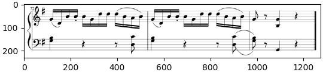
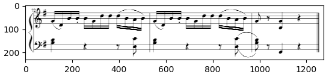
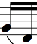
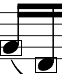
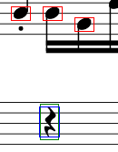

# OMR: Optical Musical notes Recognition

This is an academic project done in the course **CSCI-B 657 Computer Vision** at Indiana University.

**Tools and Technology used:** Python, NumPy, SciPy

### Part 3: Convolving using an arbitary kernel:
In this part we have to convolve the images using an arbitary kernel. Initially we went ahead with the Guassian kernel implemented using fourier transform. The results were excellent for all the music images, however, it was not the same case for templates. We weren't able to generalize for the template images. Hence, we switched to the hard-code implementation. We defined a blur kernel which convolves any image passed into the function. The results were good for both music as well as template images. The images were handled by padding it with zeros, so that when the images is convolved, it results in the same image of same size. The filter is a 3x3 kernel.

**Result:**

### Part 4: Convolving using separable kernel
In this part, we have to convolve an image using separable kernel. Again we tried differnt filters like gaussian, sharpening etc., but finally selected the blur filter (tried and tested!). The image is converted into an ndarray and paased into the function and the function saves the convolved image. Two 1D kernels were used of size 5x1 and 1X5. There are various ways we can implement this because the communitative properties of convolution. However in our case, we considered two 1D kernels as h1 and h2  and Image as I, then we implemented it as (I * h1) * h2. 

**Results**

### Part 5 and 6: Finiding similarity with template in the image
Part 5 and part 6 gives us two suggested way we can locate various characters in the musical note by finding similarity. Part 5 shows us the method to find the similarity between the templates, provided to us various characters, and the musical notes by calculating the Hamming distance between the two images. This will give the distance map. We can then find small values in the distance map, because smaller the distance more the similarity between that part of the image and the template. Part 6 implements slightly different approach, wherein we find the distance map for the nearest edge in the image. Then we multiply the result of the previous step with the edge map of the template to detect the  musical notes. We had implemented both the parts, to compare which one will perform better. We found that we were able to get good results with the implementation given in part 6, hence we moved forward with that. Now explaining our implementation, We first read the image and the template. The we used sobel filter to calculate the edge map for both the images. Now the edge map has different values, so to convert it into 0's and 1's we apply a threshold to get the perfect edges. Now since the implementation of part 6 has a time complexity of N^4, it was difficult to work with the original images to test our code. Hence we took a small part of the original image (with the area of interest), which will take less time to implement. After running our code for that small, our code was able to detect various characters (templates) in the image. Once a rough draft of the code was implented we tweaked the parameters and thresholds to improve our results. We were able to avoid having false detection and also detect maximum number of tempelate on the image. Below are the results which we got:

**Results: (Below images were used to test the rough draft of the code)**

   

### Part 7 and 8: Staff line detection for scaling and final pipeline to produce the desired output
In this part first we detected 2 sets of 5 lines. To do this we used similar strategy like the hough transform. We used edge map of the image and for every pixel we vote for pixels in the column above the current pixel. Then calculate the sum rowwise and divide by the row of the pixel. This would remove the bias of lines in the top part of image having more votes. We also vote for distance between rows in similar way to calculate the distance. Once the distance is calculated, we scale the image down or the template down to match the resolution of the image/template. Then we use the strategy given point 5 for templates of note: quarter rest and eight rest. And draw boxes for each detected pattern.

For detection of pitch of the notes, We plan to use co ordinates of center of the box drawn to find distance from the first line and then use this distance to predict the pitch if its a note.

### HOW TO RUN THE CODE:
	1. For convenience we have divided the execution of the code into 3 parts: Part3, part4 and the omr.
	2. The program takes two parameters, the image and a number which represents which part of the assignment to run.
    		1 ==> to run the part3 of the assignment
    		2 ==> to run the part4 of the assignment
    		3 ==> to run part 5 to 8 of the assignment (OMR).
	3. Command line to run the code
		python omr.py IMAGE PART
			positional arguments:
			  IMAGE		Image file from the test-images folder, to run the code on.
			  PART		Number representing the part of the assignment to execute

		example 1: to run the code for part3 on music1.png test image
			 python omr.py music1.png 1
		example 2: to run the code for omr detection on music1.png test image
			 python omr.py music1.png 3
### New Changes:
- Improved the code flow.
- Added different colored bounding box for different notes
- Included the "detected.txt" file with required details
- Due to some wrong naming convention for pillow library in import statement (we wrote pil instead of PIL), our code was not tested. We have rectified that issue.
NOTE: Unfortuately we didn't knew till last moment that we can use some in-built libraries/function and hence, we couldn't make our code optimized. So, the code still takes a lot of time for test-images. Hence, we've worked with smaller images (parts of test-images).
- main.py is the old file. It is not used anywhere in the code. Main file is **omr.py**
